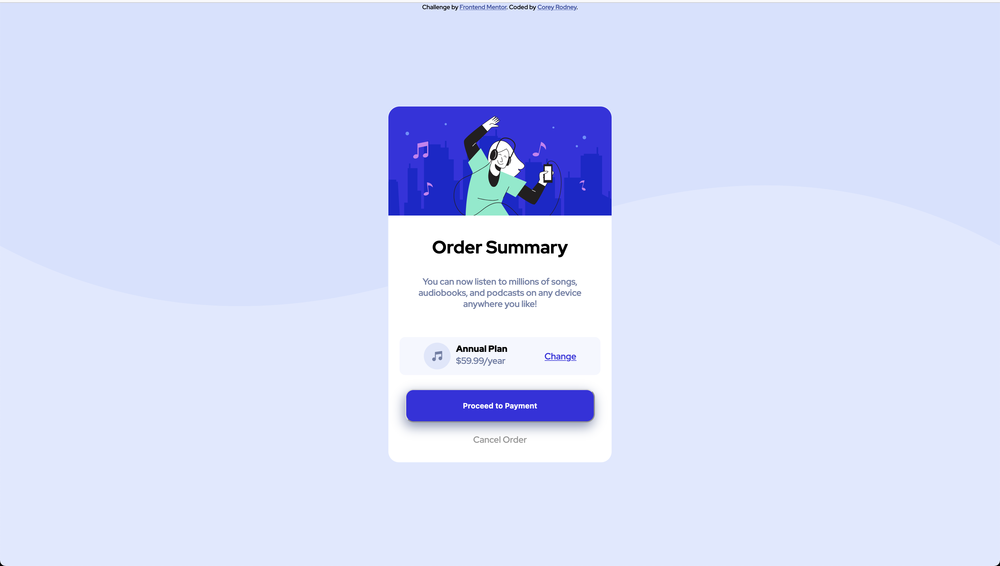

# Frontend Mentor - Order summary card solution

This is a solution to the [Order summary card challenge on Frontend Mentor](https://www.frontendmentor.io/challenges/order-summary-component-QlPmajDUj). Frontend Mentor challenges help you improve your coding skills by building realistic projects. 

## Table of contents

- [Overview](#overview)
  - [The challenge](#the-challenge)
  - [Screenshot](#screenshot)
- [My process](#my-process)
  - [Built with](#built-with)
  - [What I learned](#what-i-learned)
- [Author](#author)


## Overview
Recreate the order checkout from and make it as close as possible to the original.

### The challenge

Users should be able to:

- See hover states for interactive elements

### Screenshot




## My process
My process to solve this challenge was to break it down into small pieces. Starting with the html markup. I then continued to the CSS styling and worked from top to bottom. It's a little easier for me to focus on one thing at a time instead of trying to style everything all at once.  

### Built with

- Semantic HTML5 markup
- CSS 
- Flexbox
- Mobile-first workflow

### What I learned

in this challenge I learn more about how to use flexbox. I also use the position property in CSS as well to center the form on the page. My biggest take away from this challenge is the use of the transform property.

```css
.main-container {
	display: flex;
	flex-direction: column;
	border: 1px solid hsl(225, 100%, 94%); 
	background-color: white;
	width: 400px;
	height: auto;
	position: absolute;
	top: 50%;
	left: 50%;
	transform: translate(-50%, -50%);
	border-radius: 20px;
}
```

If you want more help with writing markdown, we'd recommend checking out [The Markdown Guide](https://www.markdownguide.org/) to learn more.

## Author

- Website - [Corey Rodney](https://www.linkedin.com/in/corey-rodney)
- Frontend Mentor - [@dellannie](https://www.frontendmentor.io/profile/dellannie)
- Twitter - [@yourusername](https://www.twitter.com/whatzupcorey)


